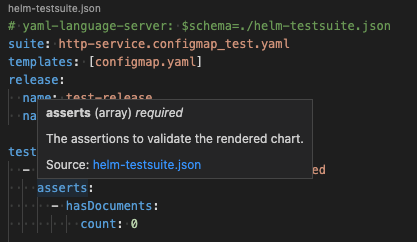
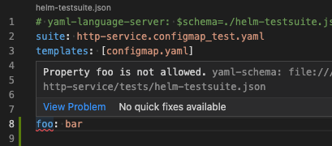
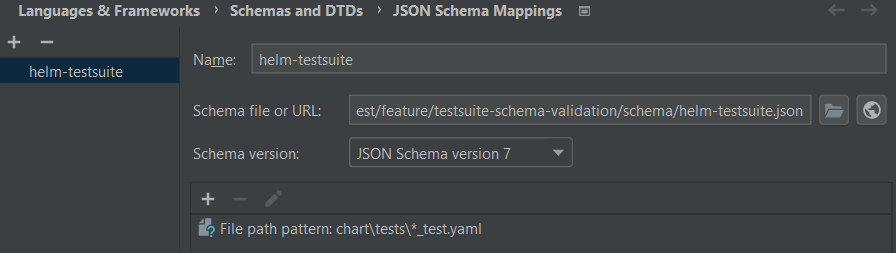

# helm unittest

[](https://circleci.com/gh/helm-unittest/helm-unittest)
[](https://goreportcard.com/report/github.com/helm-unittest/helm-unittest)
[](https://sonarcloud.io/dashboard?id=helm-unittest_helm-unittest)

Unit test for *helm chart* in YAML to keep your chart consistent and robust!

Feature:
  - write test file in pure YAML
  - render locally
  - create **nothing** on your cluster
  - [wildcard selection for templates](./DOCUMENT.md#test-suite)
  - [define values and release options](./DOCUMENT.md#test-job)
  - [snapshot testing](#snapshot-testing)
  - [test suite code completion and validation](#test-suite-code-completion-and-validation)

## Documentation

If you are ready for writing tests, check the [DOCUMENT](./DOCUMENT.md) for the test API in YAML.

- [Install](#install)
- [Docker Usage](#docker-usage)
- [Get Started](#get-started)
- [Test Suite File](#test-suite-file)
- [Usage](#usage)
  - [Flags](#flags)
  - [Yaml JsonPath Support](#yaml-jsonpath-support)
- [Example](#example)
- [Snapshot Testing](#snapshot-testing)
- [Dependent subchart Testing](#dependent-subchart-testing)
- [Tests within subchart](#tests-within-subchart)
- [Test suite code completion and validation](#test-suite-code-completion-and-validation)
- [Frequently Asked Questions](#frequently-asked-questions)
- [Related Projects / Commands](#related-projects--commands)
- [Contributing](#contributing)


## Install

```
$ helm plugin install https://github.com/helm-unittest/helm-unittest.git
```

It will install the latest version of binary into helm plugin directory.

## Docker Usage

``` 
# run help of latest helm with latest helm unittest plugin
docker run -ti --rm -v $(pwd):/apps helmunittest/helm-unittest

# run help of specific helm version with specific helm unittest plugin version
docker run -ti --rm -v $(pwd):/apps helmunittest/helm-unittest:3.11.1-0.3.0

# run unittests of a helm 3 chart
# make sure to mount local folder to /apps in container
docker run -ti --rm -v $(pwd):/apps helmunittest/helm-unittest:3.11.1-0.3.0 .

# run unittests of a helm 3 chart with Junit output for CI validation
# make sure to mount local folder to /apps in container
# the test-output.xml will be available in the local folder.
docker run -ti --rm -v $(pwd):/apps helmunittest/helm-unittest:3.11.1-0.3.0 -o test-output.xml -t junit .
```

The docker container contains the fully installed helm client, including the helm-unittest plugin.

## Get Started

Add `tests` in `.helmignore` of your chart, and create the following test file at `$YOUR_CHART/tests/deployment_test.yaml`:

```yaml
suite: test deployment
templates:
  - deployment.yaml
tests:
  - it: should work
    set:
      image.tag: latest
    asserts:
      - isKind:
          of: Deployment
      - matchRegex:
          path: metadata.name
          pattern: -my-chart$
      - equal:
          path: spec.template.spec.containers[0].image
          value: nginx:latest
```
and run:

```
$ helm unittest $YOUR_CHART
```

Now there is your first test! ;)  

## Test Suite File

The test suite file is written in pure YAML, and default placed under the `tests/` directory of the chart with suffix `_test.yaml`. You can also have your own suite files arrangement with `-f, --file` option of cli set as the glob patterns of test suite files related to chart directory, like:

```bash
$ helm unittest -f 'my-tests/*.yaml' -f 'more-tests/*.yaml' my-chart
```
Check [DOCUMENT](./DOCUMENT.md) for more details about writing tests.

## Usage

```
$ helm unittest [flags] CHART [...]
```

This renders your charts locally (without tiller) and runs tests
defined in test suite files.

## Templated Test Suites

You may find yourself needing to set up a lots o tests that are a parameterization of a single test.  For instance, let's say that you deploy to 3 environments `env = dev | staging | prod`.

In order to do this, you can actually write your tests as a helm chart as well.  If you go about this route, you
must set the `--chart-tests-path` option.  Once you have done so, helm unittest will run a standard helm render
against the values.yaml in your specified directory.

```
/my-chart
  /tests-chart
    /Chart.yaml
    /values.yaml
    /templates
      /per_env_snapshots.yaml
  
  /Chart.yaml
  /values.yaml
  /.helmignore
  /templates
    /actual_template.yaml
```

In the above example file structure, you would maintain a helm chart that will render out against the Chart.yaml
that as provided and the values.yaml.  With rendered charts, any test suite that is generated is automatically ran
we do not look for a file postfix or glob.

**Note:** since you can create multiple suites in a single template file, you must provide the suite name, since we can no longer use the test suite file name meaningfully.

**Note 2:** since you can be running against subcharts and multiple charts, you need to make sure that you do not designate your `--chart-tests-path` to be the same folder as your other tests.  This is because we will try to render those non-helm test folders and fail during the unit test.

The command for the above chart and test configuration would be:

```shell
helm unittest --chart-tests-path tests-chart my-chart
```

### Flags

```
      --color                  enforce printing colored output even stdout is not a tty. Set to false to disable color
      --strict                 strict parse the testsuites (default false)
  -d, --debug                  enable debug logging (default false)
  -v, --values stringArray     absolute or glob paths of values files location to override helmchart values
  -f, --file stringArray       glob paths of test files location, default to tests\*_test.yaml (default [tests\*_test.yaml])
  -q, --failfast               direct quit testing, when a test is failed (default false)
  -h, --help                   help for unittest
  -t, --output-type string     the file-format where testresults are written in, accepted types are (JUnit, NUnit, XUnit) (default XUnit)
  -o, --output-file string     the file where testresults are written in format specified, defaults no output is written to file
  -u, --update-snapshot        update the snapshot cached if needed, make sure you review the change before update
  -s, --with-subchart charts   include tests of the subcharts within charts folder (default true)
      --chart-tests-path string the folder location relative to the chart where a helm chart to render test suites is located
```

### Yaml JsonPath Support
Now JsonPath is supported for mappings and arrays.
This makes it possible to find items in an array, based on JsonPath.
For more detail on the [`jsonPath`](https://github.com/vmware-labs/yaml-jsonpath#syntax) syntax.

Due to the change to JsonPath, the map keys in `path` containing periods (`.`) or special characters (`/`) are now supported with the use of `""`:

```yaml
- equal:
    path: metadata.annotations["kubernetes.io/ingress.class"]
    value: nginx
```

The next releases it will be possible to validate multiple paths when JsonPath result into multiple results. 

## Example

Check [`test/data/v3/basic/`](./test/data/v3/basic) for some basic use cases of a simple chart.

## Snapshot Testing

Sometimes you may just want to keep the rendered manifest not changed between changes without every details asserted. That's the reason for snapshot testing! Check the tests below:

```yaml
templates:
  - templates/deployment.yaml
tests:
  - it: pod spec should match snapshot
    asserts:
      - matchSnapshot:
          path: spec.template.spec
  # or you can snapshot the whole manifest
  - it: manifest should match snapshot
    asserts:
      - matchSnapshot: {}
```

The `matchSnapshot` assertion validate the content rendered the same as cached last time. It fails if the content changed, and you should check and update the cache with `-u, --update-snapshot` option of cli.

```
$ helm unittest -u my-chart
```
The cache files is stored as `__snapshot__/*_test.yaml.snap` at the directory your test file placed, you should add them in version control with your chart.

## Dependent subchart Testing

If you have dependent subcharts (installed via `helm dependency`) existed in `charts` directory (they don't need to be extracted), it is possible to unittest these from the root chart. This feature can be helpfull to validate if good default values are accidently overwritten within your default helm chart.

```yaml
# $YOUR_CHART/tests/xxx_test.yaml
templates:
  - charts/postgresql/templates/xxx.yaml
tests:
  - it:
    set:
      # this time required to prefix with "postgresql."
      postgresql.somevalue: should_be_scoped
    asserts:
      - ...
```
Note 1: if dependent subcharts uses an alias, use the alias name in the templates.
Note 2: using the folder structure in templates can also be used to unittest templates which are placed in subfolders or unittest subcharts from the rootchart.

Check [`test/data/v3/with-subchart/`](./test/data/v3/with-subchart) as an example.

## Tests within subchart

If you have customized subchart (not installed via `helm dependency`) existed in `charts` directory, tests inside would also be executed by default. You can disable this behavior by setting `--with-subchart=false` flag in cli, thus only the tests in root chart will be executed. Notice that the values defined in subchart tests will be automatically scoped, you don't have to add dependency scope yourself:

```yaml
# with-subchart/charts/child-chart/tests/xxx_test.yaml
templates:
  - templates/xxx.yaml
tests:
  - it:
    set:
      # no need to prefix with "child-chart."
      somevalue: should_be_scoped
    asserts:
      - ...
```
Check [`test/data/v3/with-subchart/`](./test/data/v3/with-subchart) as an example.

## Test Suite code completion and validation

Most popular IDEs (IntelliJ, Visual Studio Code, etc.) support applying schemas to YAML files using a JSON Schema. This provides comprehensive documentation as well as code completion while editing the test-suite file:



In addition, test-suite files can be validated while editing so wrongfully added additional properties or incorrect data types can be detected while editing:



### Visual Studio Code
When developing with VSCode, the very popular YAML plug-in (created by RedHat) allows adding references to schemas by adding a comment line on top of the file:

``` yaml
# yaml-language-server: $schema=https://raw.githubusercontent.com/helm-unittest/helm-unittest/main/schema/helm-testsuite.json
suite: http-service.configmap_test.yaml
templates: [configmap.yaml]
release:
  name: test-release
  namespace: TEST_NAMESPACE
```

Alternatively, you can add the schema globally to the IDE, using a well defined pattern:

``` json
"yaml.schemas": {
  "https://raw.githubusercontent.com/helm-unittest/helm-unittest/main/schema/helm-testsuite.json": ["charts/*/tests/*_test.yaml"]
}
```

### IntelliJ
Similar to VSCode, IntelliJ allows mapping file patterns to schemas via preferences: Languages & Frameworks -> Schemas and DTDs -> JSON Schema Mappings



## Frequently Asked Questions

As more people use the unittest plugin, more questions will come. Therefore a [Frequently Asked Question page](./FAQ.md) is created to answer the most common questions.

If you are missing an anwer to a question feel free to raise a ticket.

## Related Projects / Commands

This plugin is inspired by [helm-template](https://github.com/technosophos/helm-template), and the idea of snapshot testing and some printing format comes from [jest](https://github.com/facebook/jest).


And there are some other helm commands you might want to use:

- [`helm template`](https://github.com/kubernetes/helm/blob/master/docs/helm/helm_template.md): render the chart and print the output.

- [`helm lint`](https://github.com/kubernetes/helm/blob/master/docs/helm/helm_lint.md): examines a chart for possible issues, useful to validate chart dependencies.

- [`helm test`](https://github.com/kubernetes/helm/blob/master/docs/helm/helm_test.md): test a release with testing pod defined in chart. Note this does create resources on your cluster to verify if your release is correct. Check the [doc](https://github.com/kubernetes/helm/blob/master/docs/chart_tests.md).

Alternatively, you can also use generic tests frameworks:

- [Python](https://github.com/apache/airflow/issues/11657)

- Go - [terratest](https://blog.gruntwork.io/automated-testing-for-kubernetes-and-helm-charts-using-terratest-a4ddc4e67344)

## License

MIT

## Contributing

Issues and PRs are welcome!  
Before start developing this plugin, you must have [go] (https://golang.org/doc/install) >= 1.21 installed, and run:

```
git clone git@github.com:helm-unittest/helm-unittest.git
cd helm-unittest
```

And please make CI passed when request a PR which would check following things:

- `gofmt` no changes needed. Please run `gofmt -w -s .` before you commit.
- `go test ./pkg/unittest/...` passed.

In some cases you might need to manually fix the tests in `*_test.go`. If the snapshot tests (of the plugin's test code) failed you need to run:

```
UPDATE_SNAPSHOTS=true go test ./...
```

This update the snapshot cache file and please add them before you commit.
